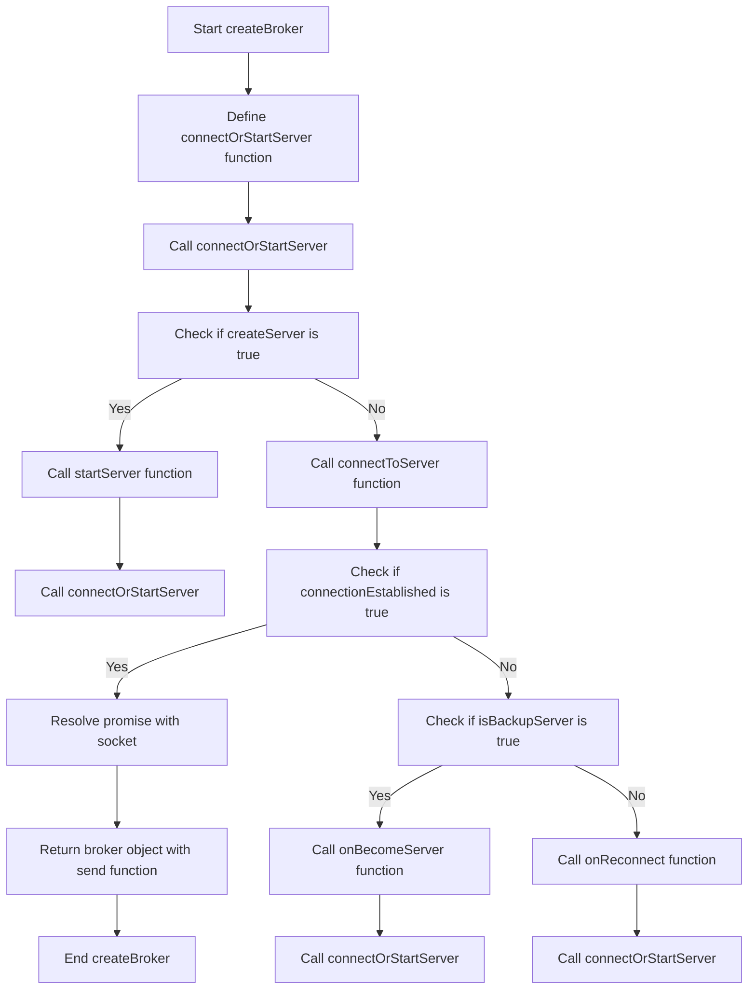

# Simple Event Broker

A simple event broker library built with TypeScript.

## Description

This library allows you to create a simple event broker for sending and receiving messages. It uses WebSocket for communication. The unique feature of this library is that it can operate in a standalone mode or connect to an existing instance if one is available. This makes it ideal for local development as it can replace more complex systems like SNS or Kafka.

When you start an instance of the event broker, it first tries to connect to an existing server. If it can't find one, it starts its own server. This means you don't need to manually manage servers for your event broker. If another instance is started, it will automatically connect to the existing server. This allows for easy scaling and management of your event broker instances.



## Description

This library allows you to create a simple event broker for sending and receiving messages. It uses WebSocket for communication.

## Installation

Install the library using npm:

```bash
npm install simple-event-broker
```

## Usage

Import the createBroker function from the library:

```typescript
import { createBroker } from 'simple-event-broker';
```

Create a broker and provide a callback function to handle incoming messages:

```typescript
const broker = createBroker((message) => {
  console.log(message);
});
```

Send a message to the broker:

```typescript
broker.send('Hello world!');
```

## License
